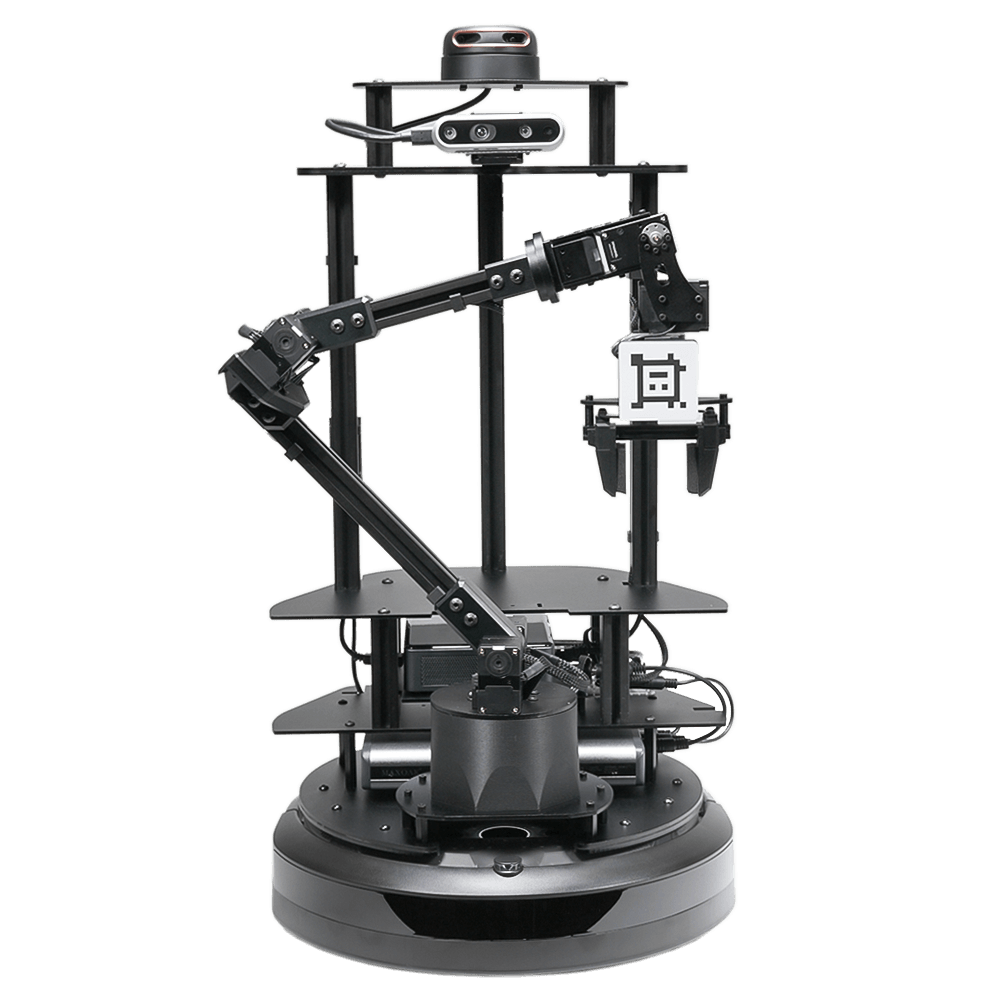
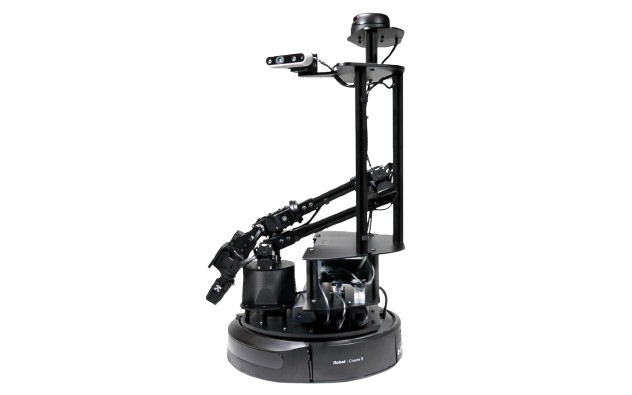

# Interbotix LoCoBot

{width="250px"} {width="400px"} 


## 1. Hardware

### 1-1. Power

機上電力全由左下圖中的大行充供給，沒電時就充行充。  
NUC 位置如右下圖所示，在大行充的上方隔板，接上電源後，須手動按按鈕開機。

{width="300px"} {width="300px"}

!!! info "其他硬體資訊"

    想了解機上的硬體設備可以參考官網：

    * LoCoBot 馬達參數、尺寸：[LoCoBot WidowX-200](https://docs.trossenrobotics.com/interbotix_xslocobots_docs/specifications/locobot_wx200.html#default-servo-configurations)
    * LoCoBot 硬體表、感測器：[LoCoBot Hardware](https://docs.trossenrobotics.com/interbotix_xslocobots_docs/specifications.html#hardware)
    * 官方 ROS2 Package：[Interbotix/interbotix_ros_rovers](https://github.com/Interbotix/interbotix_ros_rovers)
---

## 2. Software

由於 LoCoBot 使用者多，每人開發習慣不同，也使用不同 repo。  
以下開啟方式為 @ken900308 維護，如果須特定功能請找相關的開發者哦。

> Repository: https://github.com/hrc-pme/locobot_ros2_wrapper

開啟步驟：

1. 將機上 NUC 開機，並 SSH 遠端登入。
2. 找空的資料夾路徑(如 `/home/myname/` )，下載此 repo。  
   ```
   git clone https://github.com/hrc-pme/locobot_ros2_wrapper
   cd locobot_ros2_wrapper
   ```
3. 在 repo 根目錄執行 `source run.sh` 進入開發容器環境。  
   在 container 內，開啟不同終端執行不同功能：
   * 跑底盤驅動： `bash /workspace/quick_start/terminal1_ros2.sh`
   * VR 手臂控制： `bash /workspace/quick_start/terminal2_ros2.sh`
   * RosBridge server： `bash /workspace/quick_start/terminal5_ros2.sh`