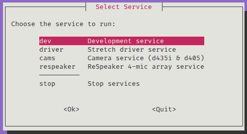

# Hello Robot Stretch 3

{ width=340px } 
&nbsp;&nbsp;&nbsp;&nbsp;&nbsp;&nbsp;&nbsp;&nbsp;&nbsp;
&nbsp;&nbsp;&nbsp;&nbsp;&nbsp;&nbsp;&nbsp;&nbsp;&nbsp;
&nbsp;&nbsp;&nbsp;&nbsp;&nbsp;&nbsp;&nbsp;&nbsp;&nbsp;
{ width=200px } 

---

## 1. Hardware

### 1-1. Power

機身後側有電源鍵，按下即可啟動所有馬達及電腦。  
板上也有其他 USB, HDMI 以及乙太網口，視自己需求彈性使用就好。

  {width="500px"}

???+ warning "注意事項"

    關機時，請先透過終端將電腦關機，在按下按鍵切斷整台電源。   


### 1-2. Emergency Stop

緊急開關位於機身頂部側邊，一個半透明的塑膠按鈕。  
拍下去只會將馬達斷電，電腦及相機等感測器仍正常運作。  

  {width="400px"}

機器運作時務必隨時準備好拍緊急開關。

???+ info "燈顯"

    如圖中常亮白色，代表機器正常上電。  
    按下緊急開關後，會轉為呼吸燈。

### 1-3. Battery

電池可熱插拔，如果機器須移動，直接拔掉電源線就會用機上電池供電。

充電時請短按或長按電池上的灰色按鈕，直到**紅燈亮在 12V 粉框內**。  

  {width="500px"}

??? info "接線示意圖"

    


### 1-4. Clamp

下電後手臂可能會緩慢下滑，在關機後可用固定夾咬住升降桿，防止撞擊底盤。

  {width="500px"}


---

## 2. Software

由於 Stretch3 使用者多，每人開發習慣不同，也使用不同 repo。  
以下開啟方式為 @pomelo925 維護，如果須特定功能請找相關的開發者哦。

> Repository: https://github.com/hrc-pme/helloRobot_stretch3.git

使用步驟：

1. 將電腦開機，並使用 SSH 遠端登入。  
2. 找空的資料夾路徑(如 `/home/hrc/myname/` )，下載此 repo。  
   ```
   git clone --recurse-submodules https://github.com/hrc-pme/helloRobot_stretch3.git
   cd helloRobot_stretch3
   ```
3. 在 repo 根目錄執行 `source run.sh`，會跳出頁面如下。
   
      

    不同的功能已經被封裝成獨立的容器，其中：
    
    * dev: 進入開發環境，不執行任何程式。
    * driver: 開啟底盤和手臂，等待速度指令。
    * cams: 開啟機上兩台 Realsense。
    * respeaker: 開啟麥克風陣列。
  
    ??? info "選單後續選項"

        ROS DOMAIN ID 預設可以選 0 就好。
   
        

4. 開啟後會進入 container 終端:

    

    ??? info "一些細節"

          1. 選擇 dev 以外的服務如 driver, cams 等可以去看 ros2 topic 有沒有對應 topic。
          2. 若要同時開多個 service，直接 ctrl+C 關閉容器終端（不會終止容器），跳回 host terminal，再開另個。
          3. 要關閉 service，直接把對應的 container 移除即可。
          4. 記得所有的 container 要在同個 ROS DOMAIN ID 才能互相溝通。