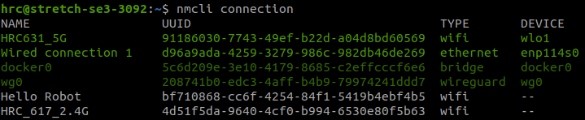

# 4. ETH over SSH

> 在某些情況下不方便或無法使用 router 時，可以使用 Ethernet（乙太網路）實體連接兩台裝置進行通訊。  
> 即便沒有 Wi-Fi，也能穩定 SSH 連線並監控目標機器的運作狀態。

!!! tip "推薦資源"

    SSH 金鑰驗證、設定檔等基礎操作，請先參閱 O-Week 的 [2. SSH](../oweek/2.ssh/)。

---

## 1. 背景

### 1-1. 使用場景

實驗室常見的連線拓撲如下：

```
Linux Host OS ─── ETH ─── Linux Robot (e.g. Stretch 3)
```

| 情境 | 說明 |
|------|------|
| 機器人現場除錯 | 筆電以網路線直連機器人，不依賴 Wi-Fi |
| 無 router 環境 | 展場、戶外或 router 故障時仍能連線 |
| 穩定低延遲通訊 | 有線連線適合 ROS 2、影像串流等流量 |
| 搭配 Zenoh / DDS | 跨機通訊的前置網路設定，詳見 [5. Zenoh Middleware](5.zenoh-middleware/) |

---

### 1-2. 與 Wi-Fi SSH 的差異

整體流程與 Wi-Fi 下的 SSH **幾乎相同**，主要差別在於：

- 需**手動設定靜態 IP**（乙太網路直連時通常沒有 DHCP server）
- 需確認使用的是正確的 **Ethernet 介面**（如 `eth0`）
- 兩端 IP 須在同一子網（例如 `192.168.10.0/24`）

| 項目 | Wi-Fi SSH | ETH over SSH |
|------|-----------|--------------|
| IP 取得 | 通常由 router DHCP 分配 | 需手動設定靜態 IP |
| 網路硬體 | 無線網卡 | 乙太網路埠 + 網路線 |
| 連線穩定度 | 受訊號影響 | 有線，較穩定 |
| SSH 設定 | 相同 | 相同 |

---

## 2. 流程概覽

!!! abstract "整體步驟"

    1. 以乙太網路線連接兩台 Linux 裝置
    2. 分別在兩端設定靜態 IP
    3. 以 `ping` 確認雙方可互通
    4. 確認 SSH 服務已啟用
    5. 使用 VSCode Remote SSH 或終端機連線

| 機器 | 角色（範例） | IP |
|------|-------------|-----|
| Local Host | 開發用筆電 | `192.168.10.1` |
| Remote Host | 機器人（Stretch 3 等） | `192.168.10.2` |

---

## 3. 靜態 IP 設定

插入乙太網路線後，透過 `nmcli`（NetworkManager Command-Line Interface）設定靜態 IP。

---

### 3-1. 檢查連線狀態

在**兩台機器**上分別執行：

```bash
sudo nmcli connection
```

幾點注意：

- 每行列出一個網路連線設定，**UUID** 是各規則的唯一識別碼
- **綠色**表示正在使用；**白灰色**表示已儲存但目前未啟用
- 插入 ETH 後，系統會自動選用一個現有規則；若從未設定過，通常會產生 `Wired connection 1`
- 設定檔可手動命名，並可綁定特定 MAC address

??? info "nmcli connection 範例輸出"

    

同時確認乙太網路介面名稱（常見為 `eth0` 或 `enp*`）：

```bash
ip link show
```

---

### 3-2. 設定雙方 IP

將 `"<name>"` 替換為上一步查到的連線名稱（例如 `Wired connection 1` 或 `stretch3`）。

=== "Local Host（192.168.10.1）"

    ```bash
    sudo nmcli connection modify "<name>" \
      ipv4.method manual \
      ipv4.addresses 192.168.10.1/24 \
      ipv4.gateway ""
    sudo nmcli connection up "<name>"
    ```

=== "Remote Host（192.168.10.2）"

    ```bash
    sudo nmcli connection modify "<name>" \
      ipv4.method manual \
      ipv4.addresses 192.168.10.2/24 \
      ipv4.gateway ""
    sudo nmcli connection up "<name>"
    ```

!!! info "為何 gateway 留空？"

    點對點乙太網路直連不需要預設閘道；設定空字串可避免系統誤將流量導向不存在的 gateway。

---

### 3-3. 驗證連線

在 Local Host 上：

```bash
ping -c 4 192.168.10.2
```

在 Remote Host 上：

```bash
ping -c 4 192.168.10.1
```

雙方都能收到 reply 即代表 Layer 3 連通正常。

!!! example "Checkpoint"

    1. 兩台機器能互相 `ping` 成功。
    2. `ip a` 顯示乙太網路介面已設定正確的靜態 IP。

---

## 4. SSH 連線

靜態 IP 設定完成後，其餘 SSH 操作與 Wi-Fi 環境相同。

=== "終端機連線"

    ```bash
    ssh user@192.168.10.2
    ```

    首次連線或需設定金鑰驗證，請參考 [2. SSH — 實戰練習](../oweek/2.ssh/#2-ssh)。

=== "VSCode Remote SSH"

    1. 安裝 VSCode **Remote - SSH** 擴充功能
    2. 編輯 `~/.ssh/config`，加入：

        ```jsx
        Host stretch3-eth
            HostName 192.168.10.2
            User user
            Port 22
            IdentityFile ~/.ssh/id_rsa
        ```

    3. 在 VSCode 選擇 `stretch3-eth` 連線

!!! example "Checkpoint"

    1. 能在 VSCode 中開啟 Remote Host 的資料夾，毋須輸入密碼（若已設定金鑰）。
    2. 理解 ETH 直連與 Wi-Fi 連線在 SSH 設定上無差異，差別只在 IP 設定方式。

---

## 5. nmcli 進階操作

以下是設定完成後，管理 NetworkManager 連線規則的常用指令。

---

### 5-1. 修改規則名稱

將 `"<old-name>"` 改為易辨識的名稱（例如機器人型號）：

```bash
sudo nmcli connection modify "<old-name>" connection.id "<new-name>"
```

??? info "修改名稱範例"

    

---

### 5-2. 顯示規則詳細內容

```bash
sudo nmcli connection show "<name>"
```

---

### 5-3. 切換連線規則

當同一介面有多組規則（例如 Wi-Fi 與 ETH 各一組）時，可指定介面啟用特定規則：

```bash
nmcli connection up <name> iface <eth_interface>
```

範例：

```bash
nmcli connection up stretch3 iface eth0
```

---

## 6. 常見問題

### 6-1. ping 不通

- 確認網路線已插好，兩端 link 燈有亮
- 確認 `"<name>"` 設定的是**正在使用的** ETH 連線規則
- 確認兩端 IP 在同一子網（如 `/24`）
- 暫時關閉防火牆測試：`sudo ufw status`

---

### 6-2. IP 設定後仍無法連線

- 執行 `sudo nmcli connection up "<name>"` 重新啟用規則
- 以 `ip a` 確認介面是否已套用新 IP
- 若 IP 未更新，可嘗試 `sudo nmcli connection down "<name>"` 後再 `up`

---

### 6-3. 同時使用 Wi-Fi 與 ETH

筆電可同時連 Wi-Fi 與 ETH。SSH 時請確認連到正確 IP；  
若路由衝突，可暫時停用 Wi-Fi 或調整 metric，優先走 ETH 介面。

---

## 7. 參考連結

- [O-Week — 2. SSH](../oweek/2.ssh/)
- [NetworkManager nmcli 文件](https://networkmanager.dev/docs/api/latest/nmcli.html)
- [5. Zenoh Middleware — 跨機通訊設定](5.zenoh-middleware/)
